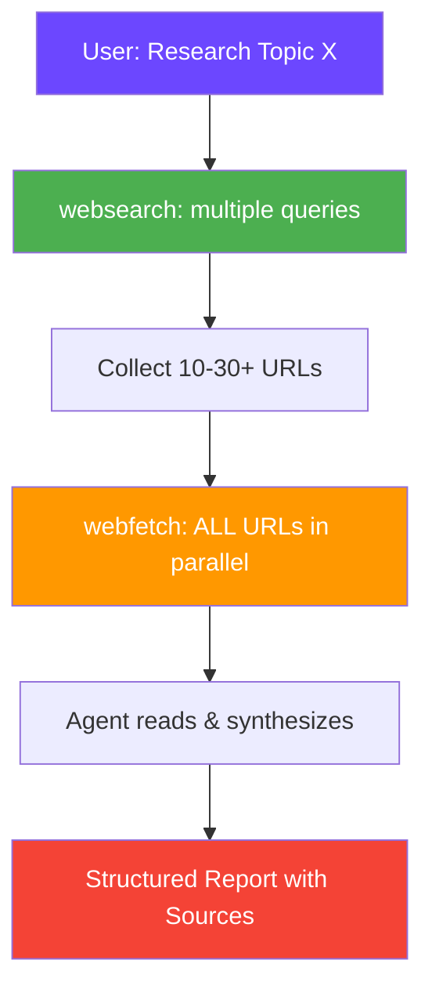

<div align="center">

# 🔬 Deep Research Skill

### *Massive autonomous web research for AI coding agents — no API keys, no limits, completely free*

[](https://github.com/FMATheNomad/deep-research-skill/releases)
[](https://github.com/FMATheNomad/deep-research-skill/stargazers)
[](https://github.com/sponsors/FMATheNomad)
[](LICENSE)
[](https://opencode.ai)

---

# ⭐️ Support This Project ⭐️

**This is a free, open-source skill built by a solo founder. If it saves you time or money, please:**

[](https://github.com/FMATheNomad/deep-research-skill/stargazers)
[](https://github.com/sponsors/FMATheNomad)

**Every star & sponsor helps a solo founder keep building free tools for everyone.** 🙏

---

> **Firecrawl who?** This skill gives your AI agent the power to search, fetch, and synthesize information from **dozens of web pages in parallel** — completely free, no API keys, no accounts, no limits.

</div>

## 🔥 Why This Exists

Firecrawl is great, but:
- ❌ Needs API key + account
- ❌ Free tier limited (500K credits)
- ❌ Self-host requires Docker + infrastructure
- ❌ AGPL license

**Deep Research Skill** uses what OpenCode already has built-in — `websearch` (powered by Exa, **free no API key**) and `webfetch` (built-in, **free**) — and orchestrates them into a massive parallel research pipeline.

## ✨ Features

| Feature | Description |
|---------|-------------|
| **🔍 Multi-Query Search** | Searches from multiple angles for comprehensive coverage |
| **⚡ Parallel Fetching** | Fetches 10-30+ pages simultaneously |
| **🧠 AI-Powered Synthesis** | Agent reads & synthesizes all content intelligently |
| **📊 Structured Output** | Comparison tables, deep dives, summaries with citations |
| **🔓 Completely Free** | No API keys, no accounts, no credit limits |
| **📚 Research Templates** | Comparison, technical, market research — ready to use |

## 🚀 Installation

### One-Click

```bash
npx skills add FMATheNomad/deep-research-skill@deep-research -g -y
```

### Manual — OpenCode

```bash
mkdir -p ~/.config/opencode/skills/deep-research
curl -o ~/.config/opencode/skills/deep-research/SKILL.md \
  https://raw.githubusercontent.com/FMATheNomad/deep-research-skill/main/skills/deep-research/SKILL.md
```

### Prerequisites

- [OpenCode](https://opencode.ai) installed
- Start with `OPENCODE_ENABLE_EXA=1 opencode` to enable `websearch`

## 🔬 How It Works



### Example Session

```
You: "Cari informasi lengkap tentang quantum computing"

Agent (deep research activated):
  → websearch("quantum computing explained")
  → websearch("quantum computing 2025 2026 breakthroughs")
  → websearch("quantum computing companies")
  → websearch("quantum computing vs classical")
  → Collected 28 URLs from Wikipedia, IBM, Nature, MIT, etc.
  
  → Fetching 28 pages in parallel...
  
  → Synthesizing findings from all sources...
  
  → 📋 Research: Quantum Computing
  
    Summary: Quantum computing leverages quantum mechanics...
    
    Key Findings:
    1. Current state: ...
    2. Major players: ...
    3. Breakthroughs in 2025-2026: ...
    
    Sources:
    - Wikipedia — overview & history
    - IBM Quantum — current technology
    - Nature — latest research papers
```

## 📋 Research Templates

### Comparison Research

```
"Compare PostgreSQL and Supabase for production use"
→ Searches: "PostgreSQL vs Supabase", "Supabase review", "PostgreSQL production tips"
→ Fetches 15+ comparison articles, reviews, docs
→ Returns comparison table: features, pricing, pros/cons, use cases
```

### Technical Deep Dive

```
"How does WebRTC work under the hood?"
→ Searches: "WebRTC explained", "WebRTC architecture", "WebRTC STUN TURN"
→ Fetches 20+ technical articles, RFCs, implementation guides
→ Returns comprehensive technical explanation with diagrams
```

### Market Research

```
"Analyze the AI code generation market in 2026"
→ Searches: "AI code generation market size", "AI coding tools comparison", "GitHub Copilot vs alternatives"
→ Fetches 25+ market reports, reviews, funding news
→ Returns market analysis with trends, competitors, opportunities
```

## ⚡ Pro Tips

1. **Enable websearch** — start OpenCode with `OPENCODE_ENABLE_EXA=1 opencode`
2. **Ask for depth** — "deep research about X, minimal 20 sources"
3. **Specify format** — "compare X and Y in a table", "give me a structured report"
4. **Iterate** — ask follow-up questions to go deeper
5. **Combine with agent-browser** — for pages that need JS/clicking, use agent-browser then webfetch

## 🆚 vs Firecrawl

| Feature | Firecrawl | **Deep Research Skill** |
|---------|-----------|------------------------|
| 💰 **Cost** | Free tier (500K credits) | **Unlimited free** |
| 🔑 **API Key** | Required | **Not needed** |
| 🏗 **Self-host** | Docker required | **Nothing to host** |
| 🔍 **Search** | Built-in | via `websearch` (Exa) |
| 📄 **Scrape** | Built-in | via `webfetch` |
| ⚡ **Parallel** | ✅ Yes | ✅ **Agent batches** |
| 🧠 **Synthesis** | Separate API | **Built into agent** |
| 📜 **License** | AGPL-3.0 | **MIT** |
| 🔌 **Setup** | CLI + API key | **Skill only** |

**Bottom line:** Firecrawl is better for automated crawling at scale (thousands of pages). Deep Research Skill is better for **intelligent research** — searching, reading, and synthesizing from dozens of pages with zero cost.

## 🗺 Roadmap

- [ ] **Bulk mode** — research 10+ topics in one session
- [ ] **PDF support** — fetch and parse academic PDFs
- [ ] **Citation export** — BibTeX, APA, MLA format
- [ ] **Research report generation** — export to markdown/PDF
- [ ] **Scheduled research** — monitor topics over time
- [ ] **Multi-language** — research in Indonesian, Japanese, etc.

## 📁 Project Structure

```
deep-research-skill/
├── .github/
│   ├── workflows/validate.yml
│   └── FUNDING.yml
├── skills/
│   └── deep-research/
│       └── SKILL.md
├── README.md
├── LICENSE
└── .gitignore
```

## 🤝 Contributing

Add new research templates, improve the pipeline, or suggest features. See [CONTRIBUTING.md](CONTRIBUTING.md).

<div align="center">

---

## ⭐️ Support the Project ⭐️

**Built by a solo founder who got tired of API keys and credit limits.**  
If this skill helps you, please support it — every bit counts:

[](https://github.com/FMATheNomad/deep-research-skill/stargazers)
[](https://github.com/sponsors/FMATheNomad)
[](https://x.com/intent/tweet?text=🔥%20Firecrawl%20alternative%20-%20completely%20free%2C%20no%20API%20keys.%20Deep%20research%20skill%20for%20AI%20coding%20agents.%20Search%20%26%20read%20dozens%20of%20pages%20in%20parallel.%20%F0%9F%94%AC&url=https://github.com/FMATheNomad/deep-research-skill)

---

*Free research for everyone. Open source. MIT licensed.*

[](https://fmasoftwarelabs.up.railway.app)
[](https://x.com/fmathenomad)

</div>
