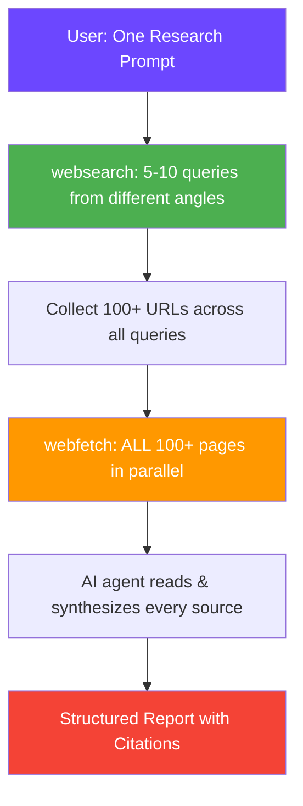

<div align="center">

# 🔬 Deep Research Skill

### *Browse hundreds of sources in parallel — like DeepSeek, but inside your AI coding agent. No API keys, no limits, completely free.*

[](https://github.com/FMATheNomad/deep-research-skill/releases)
[](https://github.com/FMATheNomad/deep-research-skill/stargazers)
[](https://github.com/sponsors/FMATheNomad)
[](LICENSE)
[](https://opencode.ai)

---

# ⭐️ Support This Project ⭐️

**This is a free, open-source skill built by a solo founder. If it saves you time or money, please:**

[](https://github.com/FMATheNomad/deep-research-skill/stargazers)
[](https://github.com/sponsors/FMATheNomad)

**Every star & sponsor helps a solo founder keep building free tools for everyone.** 🙏

---

> **Like DeepSeek's web research, but inside your AI coding agent.** This skill gives your AI agent the power to search, fetch, and synthesize information from **hundreds of web pages in parallel** — completely free, no API keys, no accounts, no limits. One prompt → agent autonomously searches, reads 100+ sources, and returns a synthesized report with citations.

</div>

## 🔥 Why This Exists

Firecrawl is great, but:
- ❌ Needs API key + account
- ❌ Free tier limited (500K credits)
- ❌ Self-host requires Docker + infrastructure
- ❌ AGPL license

**Deep Research Skill** uses what OpenCode already has built-in — `websearch` (powered by Exa, **free no API key**) and `webfetch` (built-in, **free**) — and orchestrates them into a massive parallel research pipeline.

## ✨ Features

| Feature | Description |
|---------|-------------|
| **🔍 Multi-Query Search** | Searches from multiple angles for comprehensive coverage |
| **⚡ Parallel Fetching** | Fetches **100+ pages** simultaneously like DeepSeek |
| **🧠 AI-Powered Synthesis** | Agent reads & synthesizes all content intelligently |
| **📊 Structured Output** | Comparison tables, deep dives, summaries with citations |
| **🔓 Completely Free** | No API keys, no accounts, no credit limits |
| **📚 Research Templates** | Comparison, technical, market research — ready to use |
| **🤖 Autonomous Workflow** | One prompt → search → fetch → synthesize → report |

## 🚀 Installation

### One-Liner (Semua Agent — Recommended)

```bash
curl -fsSL https://raw.githubusercontent.com/FMATheNomad/deep-research-skill/main/skills/deep-research/SKILL.md \
  -o ~/.agents/skills/deep-research/SKILL.md
```

`~/.agents/skills/` is compatible with **OpenCode, Claude Code, Cursor, Codex, Windsurf, Cline**, and all tools that support the Agent Skills standard.

### OpenCode

```bash
mkdir -p ~/.config/opencode/skills/deep-research
curl -fsSL https://raw.githubusercontent.com/FMATheNomad/deep-research-skill/main/skills/deep-research/SKILL.md \
  -o ~/.config/opencode/skills/deep-research/SKILL.md
```

### Claude Code

```bash
mkdir -p ~/.claude/skills/deep-research
curl -fsSL https://raw.githubusercontent.com/FMATheNomad/deep-research-skill/main/skills/deep-research/SKILL.md \
  -o ~/.claude/skills/deep-research/SKILL.md
```

### Prerequisites

- [OpenCode](https://opencode.ai) installed or any AI coding agent
- Start with `OPENCODE_ENABLE_EXA=1 opencode` to enable `websearch` (OpenCode only)

## 🔬 How It Works



### Example Session (Real — 100+ Sources)

```
You: "Deep research tentang teknologi DNA sequencing terbaru, cari 50+ sumber"

Agent (deep research activated):
  → websearch("DNA sequencing 2025 2026 breakthroughs")
  → websearch("next generation sequencing technology latest")
  → websearch("long read sequencing pacbio nanopore")
  → websearch("DNA sequencing market 2026")
  → websearch("AI in genomics 2025")
  → Collected 120+ URLs from Wikipedia, Nature, Illumina, PacBio, etc.

  → Spawning 3 sub-agents in parallel:
     → Agent 1: Research Illumina + Element Biosciences + MGI
     → Agent 2: Research Oxford Nanopore + PacBio HiFi
     → Agent 3: Research AI applications + market trends
     
  → All 3 agents fetching 40+ pages each in parallel...
  
  → Synthesizing all findings from 100+ sources...
  
  → 📋 Research: DNA Sequencing Technology 2025-2026
  
    Summary: 3 technology generations coexisting...
    
    Key Findings:
    1. Illumina 5-base solution (2026) — detect 5 DNA bases in 1 assay
    2. PacBio HiFi — 99.9% accuracy, $345/genome
    3. Oxford Nanopore — portable, real-time, ultra-long reads
    4. Element AVITI — new chemistry disrupting pricing
    
    Sources (100+):
    - Wikipedia — history & methods
    - Illumina — NGS technology
    - Oxford Nanopore — nanopore tech
    - PacBio — HiFi sequencing
    - Nature — cancer research papers
    - Google Scholar — 59+ cited papers
    - Element Biosciences — Avidite chemistry
```

## 📋 Research Templates

### Comparison Research

```
"Compare PostgreSQL and Supabase for production use"
→ Searches: "PostgreSQL vs Supabase", "Supabase review", "PostgreSQL production tips"
→ Fetches 15+ comparison articles, reviews, docs
→ Returns comparison table: features, pricing, pros/cons, use cases
```

### Technical Deep Dive

```
"How does WebRTC work under the hood?"
→ Searches: "WebRTC explained", "WebRTC architecture", "WebRTC STUN TURN"
→ Fetches 20+ technical articles, RFCs, implementation guides
→ Returns comprehensive technical explanation with diagrams
```

### Market Research

```
"Analyze the AI code generation market in 2026"
→ Searches: "AI code generation market size", "AI coding tools comparison", "GitHub Copilot vs alternatives"
→ Fetches 25+ market reports, reviews, funding news
→ Returns market analysis with trends, competitors, opportunities
```

## ⚡ Pro Tips

1. **Enable websearch** — start OpenCode with `OPENCODE_ENABLE_EXA=1 opencode`
2. **Ask for 100+ sources** — "deep research about X, cari 100+ sumber"
3. **Use sub-agents** — "pakai 3 sub-agent, masing-masing riset aspek berbeda"
4. **Specify format** — "compare X and Y in a table", "give me a structured report"
5. **Iterate** — ask follow-up questions to go deeper
6. **Combine with agent-browser** — for pages that need JS/clicking, use agent-browser then webfetch

## 🆚 DeepSeek vs Firecrawl

| Feature | DeepSeek App | Firecrawl | **Deep Research Skill (Ours)** |
|---------|-------------|-----------|------------------------------|
| 💰 **Cost** | Free (limited) | Free tier (500K credits) | **Unlimited free** |
| 🔑 **API Key** | Not needed | Required | **Not needed** |
| 🌐 **Hundreds of sources** | ✅ Yes | ✅ Yes | **✅ Yes — agent batches** |
| 🧠 **AI synthesis** | ✅ Built-in | Separate API | **✅ Built into agent** |
| 🔌 **Works inside coding agent** | ❌ No | ❌ No (separate CLI) | **✅ Native OpenCode/Claude** |
| 🔍 **Search** | Built-in | Built-in | via `websearch` (Exa) |
| 📄 **Scrape** | Built-in | Built-in | via `webfetch` |
| 📜 **License** | Proprietary | AGPL-3.0 | **MIT** |
| 🛠 **Customizable** | ❌ No | Limited | **✅ Full control** |

**Bottom line:** DeepSeek is great for chat-based research. Firecrawl is better for automated crawling. **Deep Research Skill** is the only one that gives you **DeepSeek-like massive parallel research directly inside your AI coding agent** — completely free and open source.

## 🗺 Roadmap

- [ ] **Bulk mode** — research 10+ topics in one session
- [ ] **PDF support** — fetch and parse academic PDFs
- [ ] **Citation export** — BibTeX, APA, MLA format
- [ ] **Research report generation** — export to markdown/PDF
- [ ] **Scheduled research** — monitor topics over time
- [ ] **Multi-language** — research in Indonesian, Japanese, etc.

## 📁 Project Structure

```
deep-research-skill/
├── .github/
│   ├── workflows/validate.yml
│   └── FUNDING.yml
├── skills/
│   └── deep-research/
│       └── SKILL.md
├── README.md
├── LICENSE
└── .gitignore
```

## 🤝 Contributing

Add new research templates, improve the pipeline, or suggest features. See [CONTRIBUTING.md](CONTRIBUTING.md).

<div align="center">

---

## ⭐️ Support the Project ⭐️

**Built by a solo founder who got tired of API keys and credit limits.**  
If this skill helps you, please support it — every bit counts:

[](https://github.com/FMATheNomad/deep-research-skill/stargazers)
[](https://github.com/sponsors/FMATheNomad)
[](https://x.com/intent/tweet?text=🔥%20Firecrawl%20alternative%20-%20completely%20free%2C%20no%20API%20keys.%20Deep%20research%20skill%20for%20AI%20coding%20agents.%20Search%20%26%20read%20dozens%20of%20pages%20in%20parallel.%20%F0%9F%94%AC&url=https://github.com/FMATheNomad/deep-research-skill)

---

*Free research for everyone. Open source. MIT licensed.*

[](https://fmasoftwarelabs.up.railway.app)
[](https://x.com/fmathenomad)

</div>
